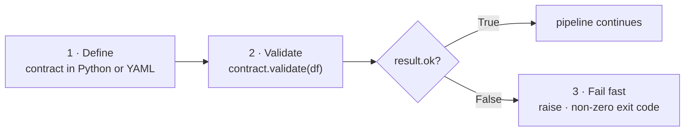

# dqflow

<p align="center">
  <picture>
    <source
      media="(prefers-color-scheme: dark)"
      srcset="https://raw.githubusercontent.com/dqflow/dqflow/main/docs/assets/dqflow-dark-logo.png"
    />
    <source
      media="(prefers-color-scheme: light)"
      srcset="https://raw.githubusercontent.com/dqflow/dqflow/main/docs/assets/dqflow-light-logo.png"
    />
    
  </picture>
</p>

<p align="center"><strong>Data contracts for Python data pipelines.</strong><br/>Define → Validate → Fail Fast</p>

[](https://pypi.org/project/dqflow/)
[](https://github.com/dqflow/dqflow/actions/workflows/ci.yml)
[](https://pypi.org/project/dqflow/)
[](https://opensource.org/licenses/MIT)

---

**dqflow** lets you declare what a DataFrame must look like — required columns, valid
values, table-level rules — as a small, versionable contract, validate your data
against it inside the pipeline, and stop bad data *before* it reaches anything
downstream.

!!! warning "Early development (0.2.x)"
    The API is small and usable, but still changing.

## Workflow



## 30-second quick start

```python
import pandas as pd
from dqflow import Contract, Column

df = pd.DataFrame({
    "order_id": ["A001", "A002", None, "A004"],
    "amount":   [19.99, -5.00, 42.50, 99.00],
    "currency": ["USD", "EUR", "USD", "GBP"],
})

contract = Contract(
    name="orders",
    columns={
        "order_id": Column(str, not_null=True, unique=True),
        "amount":   Column(float, min=0),
        "currency": Column(str, allowed=["USD", "EUR"]),
    },
    rules=["row_count > 0"],
)

result = contract.validate(df)
print(result.summary())

if not result.ok:
    raise ValueError(result.summary())
```

```text
Contract 'orders': 5/8 checks passed
Failed checks:
  - not_null:order_id: Found 1 null values
  - min:amount: Minimum value -5.0 is below 0
  - allowed:currency: Found invalid values: {'GBP'}
```

## Why dqflow

- **Contracts, not scattered asserts.** One declarative artifact — reviewed, diffed,
  and versioned like the rest of your code.
- **Lightweight.** Three runtime dependencies (`pandas`, `pyyaml`, `click`). No
  server, no database, no daemon.
- **Pythonic.** Plain `Contract` / `Column` objects, or YAML. Validation returns a
  structured result object, not a stack trace.
- **Fail fast, on purpose.** `result.ok` is a boolean; `dq validate --fail-fast`
  returns a non-zero exit code.

## What's implemented

| Capability | Status |
| --- | --- |
| Python & YAML contracts | :material-check: Implemented |
| Schema check — required columns must be present | :material-check: Implemented |
| Validity checks — `not_null`, `min`, `max`, `allowed`, `unique` | :material-check: Implemented |
| Table rules — `row_count`, `null_rate('col')`, `unique_count('col')` | :material-check: Implemented |
| Cross-column rules — `left`/`op`/`right` or a callable | :material-check: Implemented |
| Structured results — `.ok`, `.failed_checks`, `.summary()`, `.to_dict()` | :material-check: Implemented |
| CLI — `dq validate` / `dq show` / `dq infer` | :material-check: Implemented |
| pandas engine | :material-check: Implemented |
| Polars engine (`dqflow[polars]`) | :material-flask: Experimental |
| Declared `dtype` / `freshness_minutes` / `pattern` / `custom` enforcement | :material-clock-outline: Not yet enforced |
| PySpark & SQL engines, `dq diff`, GitHub Action, HTML reports | :material-clock-outline: Planned |

!!! note
    A `Column` accepts `dtype`, `freshness_minutes`, `pattern`, and `custom` today,
    and `dq show` / `dq infer` use the declared dtype — but the engines do **not** yet
    validate data against them. See the [roadmap](https://github.com/dqflow/dqflow/blob/main/ROADMAP.md).

## When to use dqflow

- You have Python data pipelines — Airflow, Dagster, Prefect, dbt-adjacent scripts,
  notebooks headed for production.
- You want data expectations in git, reviewed in pull requests.
- You want a pipeline step or CI job to **hard-fail** on bad data.
- Your data fits in memory as a pandas (or Polars) DataFrame.

## When *not* to use dqflow

- You need dashboards, alerting, anomaly detection, or lineage — dqflow produces
  files and exit codes, not a web app.
- You need warehouse push-down or Spark-scale distributed validation (planned, not
  available).
- You need dtype / regex / freshness enforced *today*.

!!! quote
    dqflow is **not** a full data observability platform. It is a small, opinionated
    library meant to be embedded directly into pipelines. Where richer tooling is
    useful, dqflow's job is to emit clean, structured results those systems can
    consume.

## Next steps

- [Installation](getting-started/installation.md)
- [Quick Start](getting-started/quickstart.md)
- [Defining Contracts](guide/contracts.md)
- [YAML Contracts](guide/yaml.md)
- [CLI Usage](guide/cli.md)
- [Roadmap](https://github.com/dqflow/dqflow/blob/main/ROADMAP.md)
